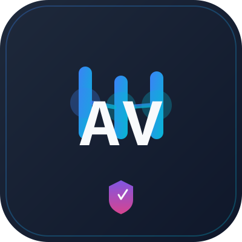

<div align="center">

<!-- Organization Banner -->


<br/>
<br/>

<!-- Project Logo -->


# jctl - Jenkins Control CLI

[](https://github.com/avidala/jctl/actions/workflows/test.yml)
[](https://github.com/avidala/jctl/actions/workflows/lint.yml)
[](https://www.python.org/downloads/)
[](https://opensource.org/licenses/MIT)

**A flexible command-line interface tool for managing Jenkins pipelines with Okta SSO authentication.**

*Part of the AVIDALA DevOps Tools suite*

</div>

## Features

- 🔐 **Dual Authentication** - Choose API tokens (simple) or OAuth 2.0 (advanced)
- 🚀 **Pipeline Management** - List, run, describe, cancel pipelines with real-time monitoring
- 📊 **Real-time Monitoring** - Stream logs and track job status
- 🎨 **Beautiful Output** - Rich terminal UI with tables and colors
- 🔧 **DevOps Optimized** - Built for HAMC pipeline workflows
- 🔒 **Secure Token Storage** - OS-native keychain integration
- ⌨️ **Shell Completion** - Tab completion for commands, subcommands, and options
- 🎯 **Multiple Profiles** - Manage dev, staging, and production environments separately

## Quick Start

### Installation

#### Option 1: Homebrew (macOS/Linux - Recommended)

```bash
# Tap the repository and install
brew install avidala/jctl/jctl

# Verify installation
jctl --version
```

#### Option 2: pipx (All platforms)

```bash
# install the latest tagged release in an isolated env
pipx install "git+https://github.com/avidala/jctl.git@v0.1.0"
```

> **Note:** the name `jctl` on PyPI belongs to an unrelated Jamf project,
> so this tool is **not** distributed via `pip install jctl`. Install via
> Homebrew (above), `pipx` from this git URL, or from source.

#### Option 3: From source

```bash
git clone https://github.com/avidala/jctl.git
cd jctl
pip install -e ".[dev]"
```

### Shell Completion (Optional but Recommended)

Enable tab completion for faster command entry:

```bash
# Automatic installation (easiest)
jctl completion --install

# Then reload your shell
source ~/.zshrc  # for zsh
source ~/.bashrc # for bash
```

After installation, you can use Tab to auto-complete:
- Command names: `jctl pipe<Tab>` → `jctl pipeline`
- Subcommands: `jctl pipeline li<Tab>` → `jctl pipeline list`
- Options: `jctl pipeline run --<Tab>` → shows `--param`, `--wait`, `--notify`

See [docs/guides/COMPLETION_GUIDE.md](docs/guides/COMPLETION_GUIDE.md) for more details and manual setup.

### Initial Setup

One command sets up everything: profile, Jenkins URL, and authentication!

```bash
# Initialize configuration (everything in one flow)
jctl config init

# You'll be prompted for:
#   1. Profile name (e.g., 'dev', 'stg', 'production')
#   2. Authentication method (API Token or Okta OAuth)
#   3. Jenkins URL
#   4. For API Token: Username and token (entered immediately)
#   5. For Okta: Domain and client ID

# That's it! You're authenticated and ready to use jctl
jctl pipeline list
jctl pipeline run <pipeline-name>
```

**Example flow:**
```
$ jctl config init
Profile name (production): dev
Authentication method [1/2/token/okta] (1): 1
Jenkins URL: https://jenkins-dev.example.com
Jenkins username: avidal
Jenkins API token: ●●●●●●●●

✓ Configuration saved
✓ Profile 'dev' created and set as default
✓ API token saved securely

You're all set! Try: jctl pipeline list
```

**Guides:**
- [docs/guides/INIT_WORKFLOW.md](docs/guides/INIT_WORKFLOW.md) - Detailed init workflow
- [docs/guides/API_TOKEN_GUIDE.md](docs/guides/API_TOKEN_GUIDE.md) - How to get Jenkins API tokens
- [docs/guides/OKTA_AUTH_GUIDE.md](docs/guides/OKTA_AUTH_GUIDE.md) - How to set up Okta OAuth

### Basic Usage

```bash
# Trigger a Jenkins job
jctl job trigger hamc-new-environment \
  --param environment_name=staging-test \
  --param aws_account_id=123456789012 \
  --wait

# List pipelines
jctl pipeline list --filter "hamc-*"

# Stream logs
jctl job logs hamc-new-environment-142 --follow

# Cancel running pipeline
jctl pipeline cancel hamc-new-environment 142
```

### Working with Multiple Environments

jctl supports multiple profiles for different Jenkins environments (dev, staging, production):

```bash
# Add profiles for different environments (API token auth only)
jctl config add-profile dev --jenkins-url https://jenkins-dev.example.com
jctl config add-profile stg --jenkins-url https://jenkins-stg.example.com

# Authenticate each profile with API tokens
jctl --profile dev auth token
jctl --profile stg auth token

# Use specific profile with --profile flag
jctl --profile dev pipeline list
jctl --profile stg pipeline run managed-cloud/hamc-upgrade-pipeline
jctl --profile production auth status
```

**Guides:**
- [docs/guides/PROFILES_WITH_TOKENS.md](docs/guides/PROFILES_WITH_TOKENS.md) - Using profiles with API tokens (simple)
- [docs/guides/PROFILES_GUIDE.md](docs/guides/PROFILES_GUIDE.md) - Complete profile configuration guide

## Command Reference

### Authentication Commands

```bash
# API Token Authentication (Quick Setup)
jctl auth token          # Configure Jenkins API token
jctl auth status         # Show authentication status
jctl auth logout         # Clear stored credentials

# OAuth SSO Authentication (Production)
jctl auth login          # Login with Okta SSO
jctl auth refresh        # Force token refresh
jctl auth logout         # Clear stored credentials
```

**Documentation:**
- [API Token Guide](docs/guides/API_TOKEN_GUIDE.md) - Quick setup with Jenkins API tokens
- [OAuth Guide](docs/guides/OKTA_AUTH_GUIDE.md) - Okta SSO authentication setup

### Job Commands

```bash
jctl job trigger <name>           # Trigger a job with parameters
jctl job logs <name> [--follow]   # View or stream job logs
```

**Options:**
- `--param KEY=VALUE` - Pass job parameters
- `--wait` - Wait for job completion
- `--follow` - Stream logs in real-time

### Pipeline Commands

```bash
jctl pipeline list                    # List available pipelines
jctl pipeline run <name>              # Execute pipeline with parameters
jctl pipeline describe <name> <num>   # Show pipeline details with stages
jctl pipeline logs <name> [num]       # View or stream pipeline logs
jctl pipeline cancel <name> <num>     # Cancel running pipeline
```

**Options:**
- `--param KEY=VALUE` - Pass pipeline parameters
- `--wait` - Wait for pipeline completion
- `--notify` - Get notification when pipeline completes
- `--follow` - Stream logs in real-time
- `--filter` - Filter pipeline list by pattern
- `--folder` - Filter by Jenkins folder

### Configuration Commands

```bash
jctl config init                      # Initialize configuration
jctl config add-profile <name>        # Add new profile
jctl config set <key> <val>           # Set configuration value
jctl config get <key>                 # Get configuration value
jctl config list                      # List all configurations
jctl config show                      # Show full configuration
```

### 🚧 Planned Features (v0.2.0)

The following commands are planned for future releases:

**Job Commands:**
- `jctl job status` - Get job status
- `jctl job stop` - Stop running job
- `jctl job history` - Show job history
- `jctl job params` - List job parameters

**Pipeline Commands:**
- `jctl pipeline search` - Search pipelines
- `jctl pipeline pause` - Pause at input step
- `jctl pipeline resume` - Resume paused pipeline
- `jctl pipeline replay` - Replay previous run
- `jctl pipeline restart` - Restart from beginning
- `jctl pipeline validate` - Validate configuration

See [CHANGELOG.md](CHANGELOG.md) for version history and roadmap.

## Configuration

Configuration is stored in `~/.jctl/config.yaml`:

```yaml
version: "1.0"
default_profile: production

profiles:
  production:
    jenkins:
      url: https://jenkins.example.com
    okta:
      domain: company.okta.com
      client_id: jenkins-cli
      redirect_uri: http://localhost:8989/callback
    output:
      format: table
      color: auto

defaults:
  timeout: 30
  retry_count: 3
  log_level: INFO
```

## Environment Variables

```bash
JCTL_PROFILE=production           # Active profile
JCTL_JENKINS_URL=https://...      # Jenkins URL
JCTL_OKTA_DOMAIN=company.okta.com   # Okta domain
JCTL_OUTPUT_FORMAT=json           # Output format
JCTL_LOG_LEVEL=DEBUG              # Log level
JCTL_NO_COLOR=1                   # Disable colors
```

## Development

### Setup Development Environment

```bash
# Install with dev dependencies
pip install -e ".[dev]"

# Install pre-commit hooks
pre-commit install

# Run tests
pytest

# Run with coverage
pytest --cov=jctl --cov-report=html

# Format code
black jctl tests

# Lint code
ruff check jctl tests

# Type check
mypy jctl
```

### Project Structure

```
cli/jenkins/
├── jctl/                      # Main package
│   ├── __init__.py
│   ├── __main__.py           # CLI entry point
│   ├── cli.py                # Click command groups
│   ├── auth/                 # Authentication module
│   │   ├── okta.py          # Okta SSO implementation
│   │   ├── token_manager.py # Token lifecycle
│   │   └── keystore.py      # Secure credential storage
│   ├── jenkins/              # Jenkins integration
│   │   ├── client.py        # API client
│   │   ├── jobs.py          # Job operations
│   │   └── pipelines.py     # Pipeline operations
│   ├── config/               # Configuration management
│   │   ├── manager.py       # Config manager
│   │   └── schemas.py       # Pydantic models
│   ├── utils/                # Utilities
│   │   ├── output.py        # Output formatting
│   │   ├── logging.py       # Logging setup
│   │   └── validators.py    # Input validation
│   └── commands/             # CLI command implementations
│       ├── auth.py
│       ├── job.py
│       ├── pipeline.py
│       └── config.py
├── tests/                    # Test suite
│   ├── unit/                # Unit tests
│   └── integration/         # Integration tests
├── docs/                     # Documentation
├── scripts/                  # Utility scripts
├── pyproject.toml           # Project configuration
└── README.md                # This file
```

## Examples

### Common Workflows

```bash
# Provision new environment
jctl pipeline run hamc-new-environment \
  --param environment_name=staging-001 \
  --param aws_account_id=123456789012 \
  --param region=us-east-1 \
  --wait --notify

# Monitor drift
jctl job trigger hamc-monitor-drift --wait

# Emergency pipeline cancellation
jctl pipeline cancel hamc-wipe-environment 89 \
  --reason "Wrong account selected"

# View pipeline execution details
jctl pipeline describe hamc-new-environment 142

# Stream pipeline logs in real-time
jctl pipeline logs hamc-new-environment 142 --follow
```

### Integration with Scripts

```bash
#!/bin/bash
# Automated environment provisioning

# Trigger job and wait for completion
jctl job trigger hamc-new-environment \
  --param environment_name=staging \
  --param aws_account_id=123456789012 \
  --wait

if [ $? -eq 0 ]; then
  echo "✓ Environment provisioned successfully"
else
  echo "✗ Environment provisioning failed"
  # View the logs to troubleshoot
  jctl job logs hamc-new-environment
  exit 1
fi
```

## Security

- Tokens stored in OS-native keychains (macOS Keychain, Linux Secret Service, Windows Credential Manager)
- OAuth 2.0 with PKCE for secure authentication
- HTTPS only for Jenkins API communication
- SSL certificate validation by default
- Audit logging for all job triggers
- Config files set with 0600 permissions

## Troubleshooting

### Authentication Issues

```bash
# Check auth status
jctl auth status

# Re-authenticate
jctl auth logout
jctl auth login
```

### Connection Issues

```bash
# Test Jenkins connectivity
jctl --debug pipeline list

# Verify configuration
jctl config get jenkins.url
```

### Token Expired

```bash
# Force token refresh
jctl auth refresh
```

## Contributing

See the main repository [CONTRIBUTING.md](../../CONTRIBUTING.md) for contribution guidelines.

## Support

- **Email**: avnervidal27@gmail.com
- **Issues**: [GitHub Issues](https://github.com/avidala/jctl/issues)


## 📚 Documentation

### Getting Started
- [Quick Start Guide](docs/guides/QUICK_START.md) - Get up and running in 2 minutes
- [Installation & Setup](docs/guides/INIT_WORKFLOW.md) - Detailed setup instructions

### Authentication
- [API Token Guide](docs/guides/API_TOKEN_GUIDE.md) - Simple authentication with Jenkins API tokens
- [Okta OAuth Guide](docs/guides/OKTA_AUTH_GUIDE.md) - Advanced SSO authentication

### Configuration
- [Multiple Profiles](docs/guides/PROFILES_GUIDE.md) - Manage dev, staging, and production
- [Profiles with API Tokens](docs/guides/PROFILES_WITH_TOKENS.md) - Simple multi-environment setup

### Advanced
- [Shell Completion](docs/guides/COMPLETION_GUIDE.md) - Enable tab completion for faster commands

### Technical Documentation
- [Architecture](docs/ARCHITECTURE.md) - System design and architecture
- [Development Guide](docs/DEVELOPMENT.md) - Contributing and development setup
- [Platform Testing](docs/PLATFORM_TESTING.md) - Testing across macOS, Linux, Windows

### Project Information
- [Changelog](CHANGELOG.md) - Version history and release notes
- [Roadmap](ROADMAP.md) - Future plans and features
- [Contributing](CONTRIBUTING.md) - How to contribute
- [Security](SECURITY.md) - Security policy and vulnerability reporting

## License

MIT License - See [LICENSE](../../LICENSE) for details.

---

<div align="center">



<br/>

**Built by AVIDALA**
*DevOps Tools & Automation*

<br/>

[](https://github.com/avidala)
[](mailto:avnervidal27@gmail.com)

</div>
